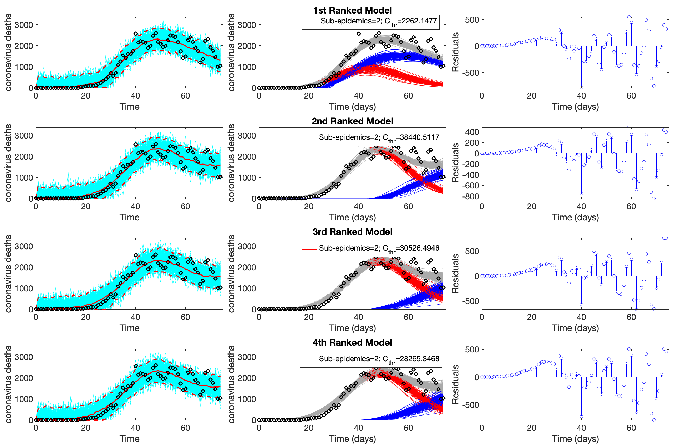
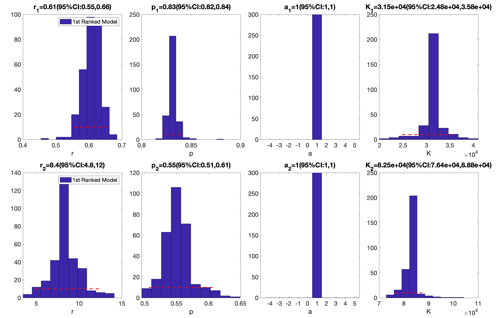
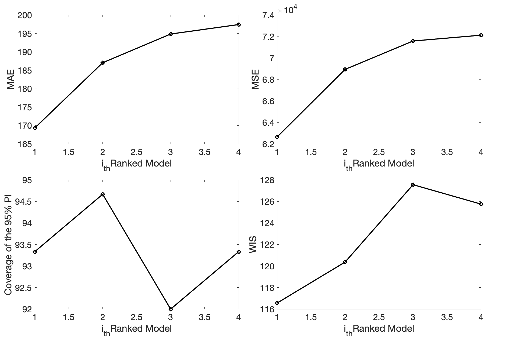
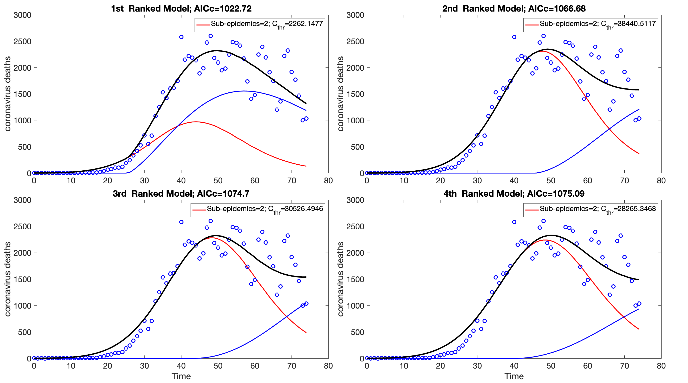
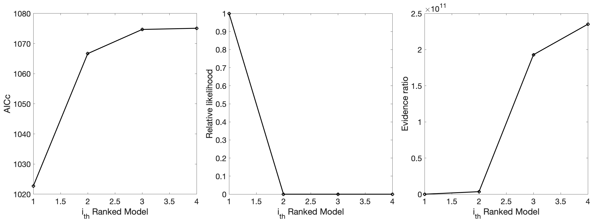
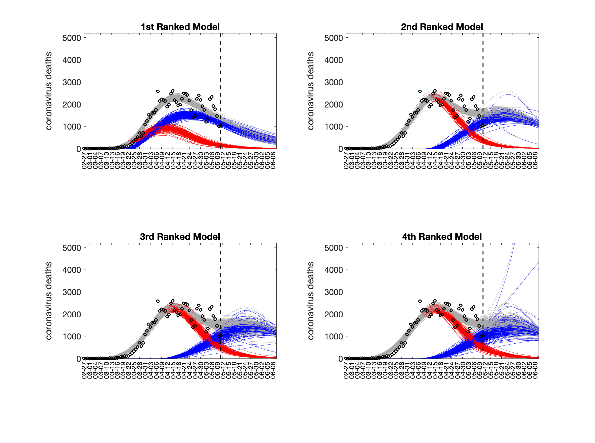
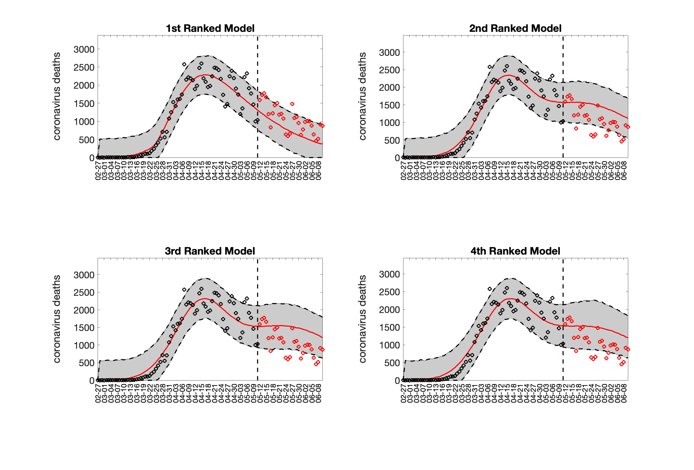
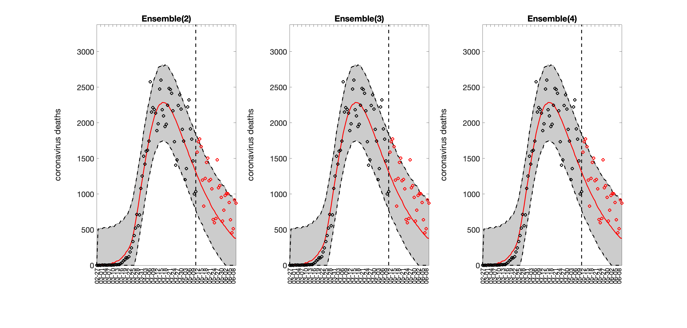
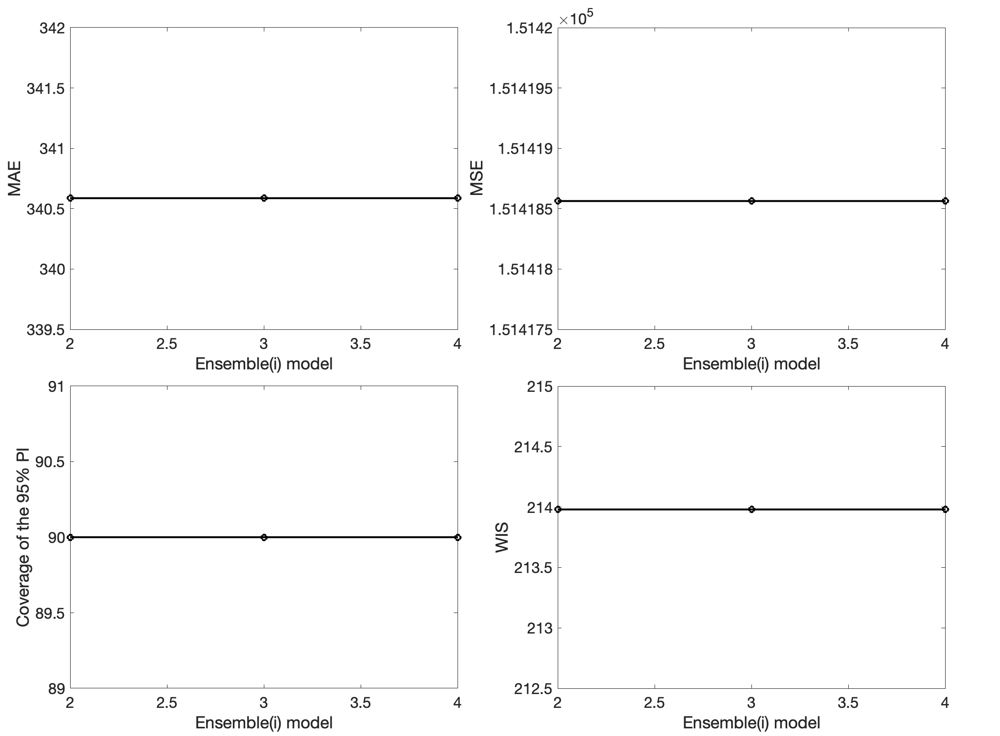
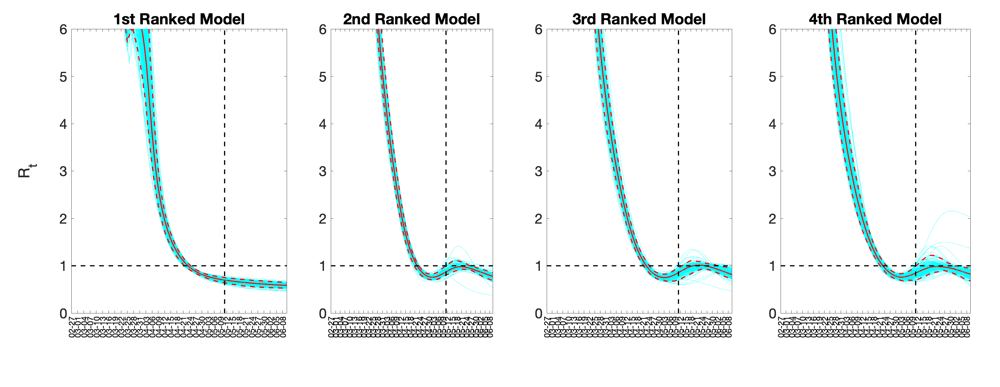

# SubEpiPredict Toolbox

**SubEpiPredict** is a user-friendly **MATLAB toolbox** designed for fitting and forecasting epidemic trajectories using the **ensemble n-subepidemic modeling framework**. This approach is particularly effective for capturing complex epidemic patterns, including multiple waves and overlapping sub-epidemics.

📄 **Tutorial Paper**  
Chowell et al. (2024), *SubEpiPredict: A tutorial-based primer and toolbox for fitting and forecasting growth trajectories using the ensemble n-sub-epidemic modeling framework*, Infectious Disease Modelling.  
👉 [Read the paper](https://www.sciencedirect.com/science/article/pii/S2468042724000125)

🎥 **Video Tutorial**  
👉 [Watch on YouTube](https://www.youtube.com/watch?v=lj_-2Kre1qw)

---

## Features

The toolbox offers the following capabilities:

- **Fitting models to time series data**
- **Estimating parameters with quantified uncertainty**
- **Plotting model fits, sub-epidemic profiles, and residuals of top-ranked models**
- **Visualizing empirical distributions of model parameters for each sub-epidemic**
- **Assessing calibration performance metrics of top-ranked models**
- **Analyzing AICc values, relative likelihoods, and evidence ratios**
- **Generating forecasts from top-ranked and ensemble models**
- **Evaluating forecasting performance metrics**
- **Estimating and plotting the effective reproduction number (Rt) from top-ranked models**

**Additional features include:**

- **Support for different parameter estimation approaches (least squares, maximum likelihood estimation)**
- **Flexibility in error structures (normal, Poisson, negative binomial)**
- **Choice of sub-epidemic building block functions:**
  - **Generalized Logistic Model (GLM)**
  - **Richards Model**
  - **Generalized Richards Model (GRM)**
- **Option to model sub-epidemics starting synchronously at time 0 or asynchronously using parameter `C_thr`**

---
    
# Installation requirements

The n-subepidemic framework toolbox requires a MATLAB installation.

| Setting                            | Where                | What it controls                                                                                  | Typical values                                                                                                                                                  |
| ---------------------------------- | -------------------- | ------------------------------------------------------------------------------------------------- | --------------------------------------------------------------------------------------------------------------------------------------------------------------- |
| `cumulative1`                      | `options.m`          | Whether the **input file** is cumulative (`type-1`) or incidence (`type-0`)                       | `0` or `1`                                                                                                                                                      |
| `DT`                               | `options.m`          | Temporal step / filename tag                                                                      | `1` (daily), `7` (weekly), `365` (yearly)                                                                                                                       |
| `outbreakx`                        | `options.m`          | **Column/area index** to analyze when the file contains multiple areas (not part of the filename) | integer (e.g., `52`)                                                                                                                                            |
| `method1` / `dist1`                | `options.m`          | Estimator & observation/error model                                                               | `method1`: `0`=LSQ, `1`=MLE Poisson, `2`=Pearson χ², `3/4/5`=MLE NegBin; `dist1`: `0`=Normal, `1`=Poisson, `2`=NegBin (LSQ-like), `3/4/5`=NegBin (MLE variants) |
| `flag1`                            | `options.m`          | Growth kernel                                                                                     | `0`=GGM, `1`=GLM, `2`=GRM, `3`=LM, `4`=RICH                                                                                                                     |
| `npatches_fixed`                   | `options.m`          | Max sub-epidemics (model complexity)                                                              | `1..N` (e.g., `2`)                                                                                                                                              |
| `smoothfactor1`                    | `options.m`          | Moving-average smoothing span (`1` = no smoothing)                                                | e.g., `7`                                                                                                                                                       |
| `calibrationperiod1`               | `options.m`          | Number of most-recent points used for calibration                                                 | e.g., `90`                                                                                                                                                      |
| `forecastingperiod`                | `options_forecast.m` | Steps ahead to predict (horizon)                                                                  | e.g., `30`                                                                                                                                                      |
| `weight_type1`                     | `options_forecast.m` | Ensemble weighting                                                                                | `-1`, `0`, `1`, or `2`                                                                                                                                          |
| `type_GId1`, `mean_GI1`, `var_GI1` | `options_Rt.m`       | GI family & parameters for Rt (use same time units as `DT`)                                       | `1/2/3`, numbers                                                                                                                                                |

# Fitting the model to your data

To use the toolbox to fit the ensemble n-subepidemic framework to your data, you just need to:

<ul>
    <li>download the code </li>
    <li>create 'input' folder in your working directory where your data is located </li>
    <li>create 'output' folder in your working directory where the output files will be stored</li>   
    <li>open a MATLAB session </li>
    <li>define the model parameter values and time series parameters by editing <code>options.m</code> </li>
    <li>run the function <code>Run_Fit_subepidemicFramework.m</code> </li>
</ul>
  
# Plotting the fits of the top-ranked models and parameter estimates

After fitting the model to your data, you can use the toolbox to plot the model fits and parameter estimates as follows:

<ul>
    <li>run the function <code>plotFit_subepidemicFramework.m</code> </li>
</ul>
    
The function also outputs a file with the calibration performance metrics of the top-ranked models.

 ## Example outputs
   

  
  

   

  

# Plotting the top-ranked subepidemic model profiles and the corresponding AIC values

After fitting the model to your data, you can use the toolbox to plot the subepidemic profiles and AICc values as follows:

<ul>
    <li>run the function <code>plotRankings_subepidemicFramework.m</code></li>
</ul>

 ## Example outputs
   

  
  

# Generating and plotting forecasts of the top-ranked and ensemble subepidemic models

After fitting the model to your data, you can use the toolbox to plot forecasts derived from the top-ranked and ensemble subepidemic models as follows:

<ul>
    <li>define the forecasting parameters by editing <code>options_forecast.m</code></li>
    <li>run the function <code>plotForecast_subepidemicFramework.m</code></li>
</ul>

The function also outputs files with the fit and forecasts of the top-ranked and ensemble models as well as the forecasting performance metrics for the top-ranked and ensemble models.

 ## Example outputs
   

  
  

 

  
  

# Generating and plotting reproduction number forecasts from the top-ranked models

After generating forecasts from top-ranked models, you can use the toolbox to generate and plot forecasts of the effective reproduction number from the top-ranked models as follows:

<ul>
    <li>define the generation interval parameters by editing the function <code>options_rt.m</code></li>
    <li>run the function <code>plotReproductionNumber.m</code></li>
</ul>

 ## Example outputs
   

  

## Output Files & Naming Conventions

| File prefix                                                        | Produced by  | Purpose                                                                                    | Key columns / contents                                                                           |
| ------------------------------------------------------------------ | ------------ | ------------------------------------------------------------------------------------------ | ------------------------------------------------------------------------------------------------ |
| `ranked(k)-… .csv`                                                 | Forecast     | **Point (central) forecast** from the **k-th top-ranked model** (AICc).                    | `time`, `mean`, `median` (optionally `sd`).                                                      |
| `Ensemble(k)-… .csv`                                               | Forecast     | **Point forecast** from the **ensemble of top k models** (weights per `options_forecast`). | `time`, `mean`, `median` (optionally `sd`).                                                      |
| `quantileTimes-ranked(k)-… .csv` / `quantile-ranked(k)-… .csv`     | Forecast     | **Forecast quantiles** for model **rank k**.                                               | `time`, `q0.025`, `q0.25`, `q0.50`, `q0.75`, `q0.975` (set may vary).                            |
| `quantileTimes-Ensemble(k)-… .csv` / `quantile-Ensemble(k)-… .csv` | Forecast     | **Ensemble forecast quantiles** (top k models).                                            | `time`, `q0.025`, `q0.25`, `q0.50`, `q0.75`, `q0.975`.                                           |
| `doublingTimes-ranked(k)-… .csv`                                   | Forecast     | **Doubling-time series** implied by model **rank k** (if applicable).                      | `time`, `median` + quantiles (e.g., `q0.025`, `q0.975`).                                         |
| `doublingTimes-Ensemble(k)-… .csv`                                 | Forecast     | **Doubling-time series** implied by the **ensemble**.                                      | `time`, `median` + quantiles.                                                                    |
| `performance-forecasting-topRanked-… .csv`                         | Forecast     | **Out-of-sample forecast metrics** for **top-ranked models**.                              | `model_rank`, `horizon`, `MAE`, `RMSE`, `MAPE`, `PI_coverage`, `PI_width`, `WIS` (set may vary). |
| `performance-forecastingEnsemble-… .csv`                           | Forecast     | **Out-of-sample metrics** for the **ensemble**.                                            | `horizon`, `MAE`, `RMSE`, `MAPE`, `PI_coverage`, `PI_width`, `WIS`.                              |
| `performance-calibration-topRanked-… .csv`                         | Fit/Forecast | **In-sample (calibration) metrics** for **top-ranked models**.                             | `model_rank`, `horizon` (if present), `MAE`, `RMSE`, `MAPE`, `PI_coverage`, `PI_width`, …        |
| `param-
-ranked(k)-… .csv`                                       | Fit/Forecast | **Parameter summaries** for parameter `
` (e.g., `r`, `a`, `K`) from model **rank k**.   | For each `
`: `mean`, `95% CI LB`, `95% CI UB` (often `SCI = log10(UB/LB)`).                   |
| `Rt-ranked(k)-… .csv`                                              | Rt           | **Effective reproduction number** series from model **rank k** using your GI assumptions.  | `time`, `Rt_median`/`Rt_mean`, quantiles (e.g., `q0.025`, `q0.975`).                             |

## Publications

- Chowell, G., Dahal, S., Bleichrodt, A., Tariq, A., Hyman, J. M., & Luo, R. (2024). *SubEpiPredict: A tutorial-based primer and toolbox for fitting and forecasting growth trajectories using the ensemble n-sub-epidemic modeling framework*. Infectious Disease Modelling, 9(2), 411-436.  
  [https://www.sciencedirect.com/science/article/pii/S2468042724000125](https://www.sciencedirect.com/science/article/pii/S2468042724000125)
- Chowell, G., Dahal, S., Tariq, A., Roosa, K., Hyman, J. M., & Luo, R. (2022). *An ensemble n-sub-epidemic modeling framework for short-term forecasting epidemic trajectories: Application to the COVID-19 pandemic in the USA*. PLOS Comput Biol, 18(10), e1010602.
- Chowell, G., Tariq, A., & Hyman, J. M. (2019). *A novel sub-epidemic modeling framework for short-term forecasting epidemic waves*. BMC Medicine, 17(1), 164.
- Bleichrodt, A., Dahal, S., Maloney, K., Casanova, L., Luo, R., & Chowell, G. (2022). *Real-time forecasting the trajectory of monkeypox outbreaks at the national and global levels, July–October 2022*. BMC Medicine, 21(1), 1–20.

---

## License

This project is licensed under the terms of the **GNU General Public License v3.0**.  
See the [LICENSE](LICENSE) file for more information.

---

## Contact

For questions or feedback, please contact:  
**Gerardo Chowell**  
[https://github.com/gchowell](https://github.com/gchowell)
