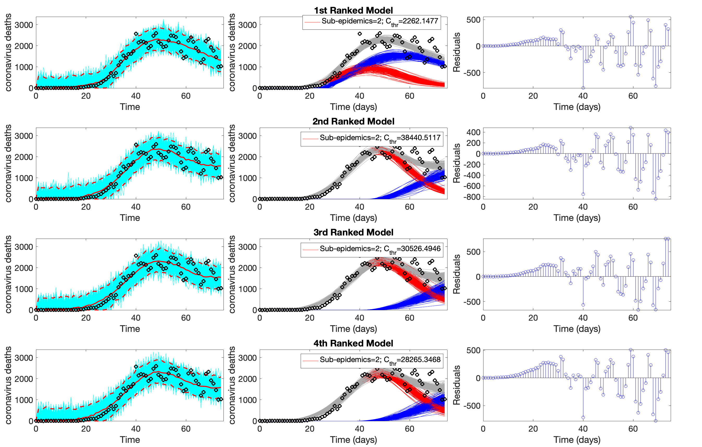
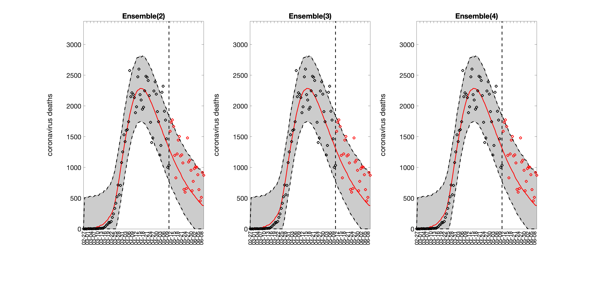
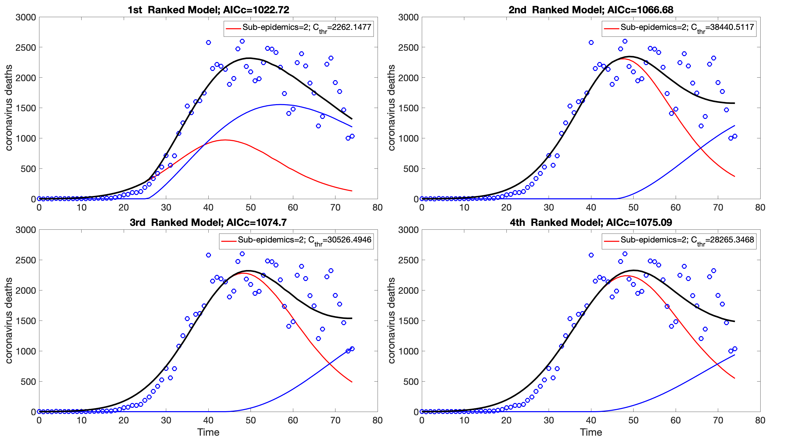
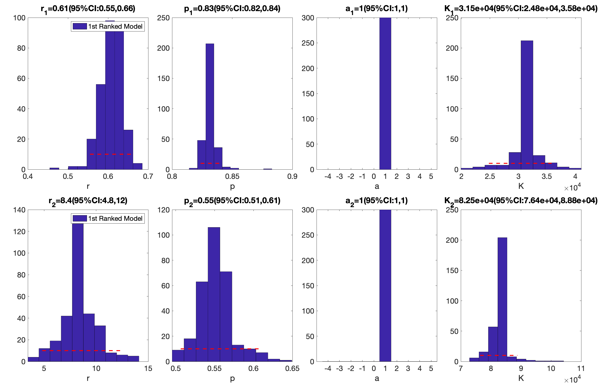

# SubEpiPredict

**Fit epidemic growth curves, quantify uncertainty, and generate ranked-model and ensemble forecasts in MATLAB.**

SubEpiPredict represents an epidemic trajectory as the sum of overlapping sub-epidemics. It searches over candidate configurations, ranks them using the corrected Akaike Information Criterion (AICc), and uses bootstrap refitting to construct parameter summaries and probabilistic forecasts. The framework accommodates single waves, plateaus, and resurgences without requiring a compartmental transmission model.

**Workflow:** observed counts → candidate sub-epidemic models → AICc ranking → bootstrap refitting → individual and ensemble forecasts.

[Paper](https://doi.org/10.1016/j.idm.2024.02.001) · [Video tutorial](https://www.youtube.com/watch?v=lj_-2Kre1qw) · [Quick start](#quick-start) · [Input data](#input-data) · [Outputs](#outputs) · [Citation](#citation)

## What the toolbox does

| Task | Main entry point |
|---|---|
| Simulate a specified sub-epidemic trajectory | `plot_nsubepidemic` |
| Search, rank, and bootstrap candidate models | `Run_Fit_subepidemicFramework` |
| Inspect fitted curves, residuals, and parameter distributions | `plotFit_subepidemicFramework` |
| Inspect ranked configurations and their AICc values | `plotRankings_subepidemicFramework` |
| Generate ranked-model and ensemble forecasts | `plotForecast_subepidemicFramework` |
| Derive effective reproduction-number trajectories | `plotReproductionNumber` |

**A sub-epidemic is a component; an ensemble member is a complete fitted model.** For example, `npatches_fixed = 2` permits candidates containing up to two components, while `topmodelsx = 4` retains four ranked candidate configurations. `Ensemble(4)` combines those four models; it does not mean a single four-component model.

These are semi-mechanistic growth models. Individual components should not automatically be interpreted as identified variants, locations, or transmission chains. Forecasts remain conditional on the fitted structure and observation assumptions.

## Requirements

| MATLAB product | Functions used in the workflow |
|---|---|
| MATLAB | `ode15s`, `smoothdata`, tables, and graphics including `tiledlayout` |
| Optimization Toolbox | `fmincon`, `optimoptions` |
| Global Optimization Toolbox | `MultiStart`, `createOptimProblem`, and start-point sets |
| Statistics and Machine Learning Toolbox | `poissrnd`, `nbinrnd`, `normrnd`, `datasample`, and generation-interval distribution functions |

## Installation

Clone the repository, or select **Code → Download ZIP** on GitHub:

```bash
git clone https://github.com/gchowell/SubEpiPredict-Toolbox.git
```

In MATLAB, set **Current Folder** to the repository root, then run:

```matlab
codeDir = fullfile(pwd, 'ensemble n-subepidemic code v1.0');
assert(isfolder(codeDir), 'Set Current Folder to the repository root first.');
addpath(codeDir);
cd(codeDir);

if ~isfolder('input'), mkdir('input'); end
if ~isfolder('output'), mkdir('output'); end

which options -all
which fmincon
which MultiStart
which nbinrnd
```

## Quick start

### 1. Check the example configuration

The bundled example uses cumulative U.S. COVID-19 death counts, with column 52 selected in:

```text
input/cumulative-daily-coronavirus-deaths-USA-05-11-2020.txt
```

In [options.m][fit-options], confirm the following existing settings. Edit assignments inside the options function; do not paste them only into the Command Window, because each entry point reloads that function.

```matlab
cumulative1 = 1;
outbreakx = 52;
caddate1 = '05-11-2020';
cadregion = 'USA';
caddisease = 'coronavirus';
datatype = 'deaths';
DT = 1;
datevecfirst1 = [2020 02 27];

smoothfactor1 = 7;
calibrationperiod1 = 90;
method1 = 0;
dist1 = 0;
numstartpoints = 20;
B = 40;
npatches_fixed = 2;
topmodelsx = 4;
flag1 = 1;
onset_fixed = 0;
```

This example file contains 75 observations. Requesting a 90-observation calibration window therefore uses the available series, subject to the leading-zero handling described below. `B = 40` is a small demonstration setting, not an established precision target for scientific interval estimates.

In [options_forecast.m][forecast-options], use:

```matlab
getperformance = 0;       % Forecast without loading future observations.
deletetempfiles = 0;      % Retain forecast MAT files for inspection.
forecastingperiod = 4;    % Four observations ahead; four days here.
weight_type1 = 1;         % Akaike weights.
```

The supplied forecast options instead default to `deletetempfiles = 1` and `weight_type1 = 0`. The settings above are deliberate changes for this example; they do not describe the shipped defaults. See [ensemble weights](#ensemble-weights) for the distinction.

### 2. Fit, inspect, and forecast

```matlab
rng(1, 'twister');
Run_Fit_subepidemicFramework(52, '05-11-2020');

plotFit_subepidemicFramework(52, '05-11-2020');
plotRankings_subepidemicFramework(52, '05-11-2020');

rng(2, 'twister');
plotForecast_subepidemicFramework(52, '05-11-2020', 4, 1);
```

Call functions **without the `.m` suffix**. The final two forecast arguments are the horizon and weighting code. Calling these functions without arguments uses the corresponding options-file settings.

Unlike the fitting entry point, `plotForecast_subepidemicFramework` loads the saved bootstrap fits and propagates them forward; it does **not** repeat the candidate search and calibration. Keep fitting settings consistent between fitting and plotting, and rerun fitting after changing the data, estimator, smoothing, or candidate-model configuration.

The examples call the forecast function without capturing its return values; use the exported files for the documented output interface.

### 3. Inspect the results

Look in `output/` for fit MAT files, parameter summaries, forecast CSVs, and calibration-performance tables. Future observations are `NaN` when forecast evaluation is disabled.

<p align="center">
  
</p>

*Bundled illustration of ranked fits and diagnostics. This is an existing example image, not a newly generated result of the commands above. The observation-simulation envelope in the fit panel is not a Bayesian credible interval.*


## Input data

### Counts only: do not prepend a time column

The input is a numeric, header-free text matrix with **rows representing successive observations and columns representing areas or groups**. The loader selects raw column `outbreakx`; it does not remove a time-index column.

For example, a two-series incidence file could begin:

```text
4   2
5   3
8   4
11  6
15  8
```

Here, `outbreakx = 1` selects `4, 5, 8, 11, 15`, and `outbreakx = 2` selects the second series. These five rows illustrate the format only; they are not a suitable multi-component calibration example.

For a single series, use one column and `outbreakx = 1`. Analyze one selected column per run; the main entry point does not jointly estimate a multivariate or spatial transmission model from all columns.

### Required filename convention

The filename is assembled from the settings; it is not an arbitrary dataset name.

| `cumulative1` | Required pattern under `input/` |
|---:|---|
| `0` | `<temporal>-<disease>-<datatype>-<region>-<date>.txt` |
| `1` | `cumulative-<temporal>-<disease>-<datatype>-<region>-<date>.txt` |

`<temporal>` is `daily`, `weekly`, or `yearly` for `DT = 1`, `7`, or `365`. The remaining tags come from `caddisease`, `datatype`, `cadregion`, and `caddate1`. Use the date format `mm-dd-yyyy` consistently.

For example:

```text
daily-influenza-cases-ExampleRegion-03-31-2024.txt
```

requires `cumulative1 = 0`, `DT = 1`, `caddisease = 'influenza'`, `datatype = 'cases'`, `cadregion = 'ExampleRegion'`, and `caddate1 = '03-31-2024'`.

### Incidence, cumulative counts, and dates

With `cumulative1 = 1`, the selected series is converted to incidence using:

```matlab
incidence = [cumulativeCounts(1); diff(cumulativeCounts)];
```

The first cumulative value is therefore treated as the first incidence observation. Account for this convention when preparing a series that begins after an outbreak has already accumulated cases. Resolve negative revisions and missing values upstream rather than passing negative differences, `NaN`, or `Inf` into count-likelihood fitting.

`datevecfirst1` is the date represented by the first input row. `caddate1` is the dated input snapshot used for fitting and calendar labeling. These dates must agree with the number and spacing of observations. `datevecend1` identifies the later data snapshot used for evaluation; it is **not** a command to truncate the fitting file at that date.

For retrospective forecasting, supply a fitting snapshot containing only observations available at the intended forecast origin. Merely changing a filename date does not remove future observations.

### Calibration and time units

The runner restricts fitting to the most recent `calibrationperiod1` observations and then removes leading zeros until the first positive observation. The retained sample can therefore be shorter than requested. An all-zero retained series is not supported.

The fitted ODE grid advances in **observation steps**: `0, 1, 2, ...`. `DT` controls calendar spacing and filename tags; it does not convert that fitted grid to days. Thus a four-step horizon means four days for daily data, four weeks for weekly data, or four annual observations for yearly data. Express fitted rates and generation-interval assumptions in the corresponding model-time units.

## Configuration

| File | Configure here |
|---|---|
| [options.m][fit-options] | Dataset, calendar metadata, calibration length, smoothing, estimator, bootstrap size, and candidate models |
| [options_forecast.m][forecast-options] | Forecast horizon, evaluation, retention of forecast MAT files, and ensemble weighting |
| [options_Rt.m][rt-options] | Generation-interval distribution and parameters for reproduction-number calculations |

| Setting | Meaning |
|---|---|
| `npatches_fixed` | Maximum number of components searched, from 1 through this value |
| `topmodelsx` | Number of ranked candidate configurations to retain and bootstrap |
| `onset_fixed` | `1`: synchronous activation at the initial time; `0`: threshold-triggered activation |
| `flag1` | One scalar growth-model code used for the components |
| `numstartpoints` | Candidate-search optimization-start setting; not the bootstrap refit start count |
| `B` | Number of synthetic datasets refitted per retained model |
| `smoothfactor1` | Moving-average span; `1` disables smoothing |
| `calibrationperiod1` | Maximum number of most recent observations used for fitting |
| `getperformance` | `1` loads later observations for forecast evaluation; `0` skips it |
| `deletetempfiles` | `1` deletes the intermediate ranked forecast MAT files after use |

For initial ensemble analyses, keep `topmodelsx` within 2–4 and no larger than the available admissible configurations. Some ensemble plot layouts assume at most `Ensemble(4)`. The options function forces one retained model when `npatches_fixed = 1` and caps the retained-model count at `npatches_fixed` for synchronous models.

## Growth models

For an active component with cumulative state `C`, the derivative branches in [modifiedLogisticGrowthPatch.m][kernel] are:

| `flag1` | Model | Implemented growth expression |
|---:|---|---|
| `0` | Generalized growth | `r * C^p` |
| `1` | Generalized logistic | `r * C^p * (1 - C/K)` |
| `2` | Generalized Richards label; outer-power variant | `r * C^p * (1 - C/K)^a` |
| `3` | Logistic | `r * C * (1 - C/K)` |
| `4` | Richards | `r * C * (1 - (C/K)^a)` |
| `5` | Gompertz | `r * C * log(K/C)` |

The default is `flag1 = 1`. Flag 3 is logistic. For flag 2, the exponent is outside the entire saturation term; do not substitute a differently parameterized generalized Richards equation when interpreting or reproducing results.

With asynchronous activation, a later component is triggered when its predecessor reaches the candidate threshold `C_thr`. Candidate fitting scans threshold values as well as component counts. With synchronous activation, all components begin at the initial time.

To inspect a trajectory without fitting data:

```matlab
plot_nsubepidemic(1, ...
    [0.18 0.18 0.18], [0.98 0.98 0.98], [], ...
    [10000 5000 1000], 3, 100, 1, 220, 0);
```

The arguments are growth flag, `r`, `p`, `a`, `K`, component count, threshold, initial observation, simulation duration, and onset mode. The explicit final `0` requests asynchronous activation. This example uses the GLM branch; some other branches of the plotting wrapper retain legacy `q_pass` checks for an argument that is not in its signature. For direct programmatic simulation, use [simulateSubepidemic.m][simulator], which manages activation events and incidence conversion; do not call the derivative as though it controlled activation itself.

## Estimation and observation models

`method1` selects the fitting objective. `dist1` selects observation-noise sampling for bootstrap datasets and predictive simulations. Let `mu` denote the fitted observation mean, `alpha` a negative-binomial dispersion parameter, and `d` its variance exponent.

| `method1` | `dist1` | Fitting objective | Observation model or variance |
|---:|---:|---|---|
| `0` | `0` | Unweighted sum of squared residuals | Normal |
| `0` | `1` | Unweighted sum of squared residuals | Poisson |
| `0` | `2` | Unweighted sum of squared residuals | Negative binomial: `Var = factor1 * mu` |
| `1` | `1` | Poisson negative log-likelihood, excluding data-only constants | Poisson |
| `3` | `3` | Negative-binomial objective | `Var = mu + alpha * mu` |
| `4` | `4` | Negative-binomial objective | `Var = mu + alpha * mu^2` |
| `5` | `5` | Negative-binomial objective | `Var = mu + alpha * mu^d` |

The options function maps methods 1, 3, 4, and 5 to the matching distribution. **Changing `dist1` under `method1 = 0` does not introduce likelihood fitting or inverse-variance weighting.** 

For standard count-likelihood analyses, use nonnegative integer observations and `smoothfactor1 = 1`. Moving-average smoothing can produce fractional values; the negative-binomial helper preserves a historical fractional-data convention rather than a standard count likelihood for those values. This preprocessing choice does not resolve the separate refitting and sampling issues noted below.

## Bootstrap uncertainty

For each retained candidate configuration, the workflow fits the observations, simulates `B` synthetic datasets, and refits them. Forecasting propagates the resulting parameter draws and adds observation noise.

| Stored object | Interpretation |
|---|---|
| `Phatss` in a fitted-model MAT file | Bootstrap parameter estimates |
| `curves` in a fitted-model MAT file | Synthetic observations generated around the fitted trajectory |
| `curvesforecasts1` in a forecast MAT file | ODE trajectories propagated from bootstrap parameter estimates |
| `curvesforecasts2` in a forecast MAT file | Predictive simulations after adding observation noise |

The forecast routine currently generates 20 observation-noise realizations per propagated parameter draw. These are not 20 additional independent bootstrap refits.

Parameter confidence intervals, uncertainty in fitted trajectories, and prediction intervals for observations are different summaries. The observation-simulation envelope in the fit plots should not be presented as parameter uncertainty alone. None of these draws is a Bayesian posterior sample.

The current bootstrap holds the selected component count and threshold fixed. It therefore describes uncertainty **conditional on that configuration**, rather than repeating the entire candidate-selection procedure. Increase `B` and assess quantile stability for the intended analysis; simply adding more noise realizations does not increase the number of parameter refits.

## Ensemble weights

`Ensemble(k)` pools sampled trajectories from the first `k` ranked models. It is a sampled mixture, not a weighted average of model parameters or a pointwise average of interval endpoints.

| `weight_type1` | Implemented weighting |
|---:|---|
| `-1` | Equal weights |
| `0` | Normalized reciprocal AICc: `w_i ∝ 1/AICc_i` — shipped default |
| `1` | Akaike weights: `w_i ∝ exp(-(AICc_i - AICc_min)/2)` |
| `2` | Normalized reciprocal calibration WIS: `w_i ∝ 1/WIS_calibration_i` |

For AICc-based ensembles, use code **1** to request Akaike weights. Code 0 is legacy reciprocal-AICc weighting, not an equivalent formula; it depends on the score origin and can misbehave for zero or negative AICc values. Check that all selected scores and resulting weights are finite and valid.

Calibration-WIS weighting uses in-sample performance, not held-out forecast performance. Code 3 appears in internal code but is not a documented, validated rolling-origin weighting workflow.

The sampler allocates a rounded number of trajectories to each member, so small sample sizes can change the realized mixture proportions or omit low-weight members.

<p align="center">
  
</p>

*Existing example ensemble forecasts. The shaded envelopes represent observation prediction intervals, not Bayesian credible bands.*

## Forecast evaluation

To evaluate a retrospective forecast, set `getperformance = 1` in `options_forecast.m` and provide a later data snapshot covering the complete requested horizon. [getData.m][data-loader] builds that filename from `datevecend1`, using the same tags and column selection as the fitting snapshot.

For the daily example, `datevecend1 = [2022 05 09]` refers to:

```text
input/cumulative-daily-coronavirus-deaths-USA-05-09-2022.txt
```

The evaluation snapshot must begin at the same `datevecfirst1` and preserve the same column meanings. A missing snapshot or insufficient follow-up produces an error rather than automatic partial-horizon scoring.

The default performance tables contain **MAE, MSE, 95% prediction-interval coverage, and weighted interval score (WIS)**. Coverage is expressed as a percentage. RMSE and mean interval score are calculated internally, but are not default columns in these tables; MAPE is not a default output.

The scoring helper evaluates cumulative leads `1:h`, and the forecast summary tables retain the full requested horizon. A horizon-4 summary therefore evaluates the four forecast observations together, not only lead 4.


## Effective reproduction number

Configure [options_Rt.m][rt-options], then run the script:

```matlab
plotReproductionNumber
```

The script loads the fitted-model files and computes reproduction-number trajectories from bootstrap model curves over the calibration period and configured forecast extension. It does not require the intermediate forecast MAT files to be retained. It begins with `clear` and `close all`, so save unrelated workspace variables first.

Supported generation-interval families are gamma (`type_GId1 = 1`), exponential (`2`), and a fixed interval (`3`). Specify the mean in **observation-step units** and the variance in squared observation-step units. For example, convert a day-scale mean to weeks by dividing by 7 and a day-squared variance by 49 for weekly data. The conversion is not automatic.

The default generation-interval values are illustrative settings, not universal pathogen parameters. These reproduction-number trajectories are conditional model-derived quantities; neither the generation-interval distribution nor its parameters are estimated from the count series by this script. Early estimates can be sensitive to the limited incidence history.

## Outputs

Files are written to `ensemble n-subepidemic code v1.0/output/`. Read the header of the file actually generated: filenames and schemas differ between routines, and the repository also contains historical outputs.

| Prefix | Main contents |
|---|---|
| `ABC-ensem-*.mat` | Candidate-search results, parameter rows, and search diagnostics |
| `modifiedLogisticPatch-ensem-*.mat` | Saved ranked fit, bootstrap parameters, and synthetic observations |
| `Forecast-modifiedLogisticPatch-*.mat` | Propagated and noisy forecast trajectories, time grid, and selected metadata; deleted when `deletetempfiles = 1` |
| `param-r-ranked(k)-*.csv`, `param-p-ranked(k)-*.csv`, `param-a-ranked(k)-*.csv`, `param-K-ranked(k)-*.csv` | Per-component parameter means, 2.5th/97.5th percentiles, and SCI diagnostics |
| `param-NB-alpha-ranked(k)-*.csv`, `param-NB-d-ranked(k)-*.csv` | Dispersion/exponent summaries when applicable |
| `ranked(k)-*.csv` | Ranked-model observation forecasts; daily/weekly columns are `year`, `month`, `day`, `data`, `median`, `LB`, `UB` |
| `Ensemble(k)-*.csv` | Ensemble observation forecasts, with calendar fields, observations, predictive median, and 95% bounds |
| `quantile-ranked(k)-*.csv` | Ranked-model calibration and forecast quantiles; 23 columns from `Q_0.010` through `Q_0.990` |
| `quantileTimes-Ensemble(k)-*.csv` | Ensemble calibration and forecast quantiles using the same 23 levels |
| `performance-calibration-topRanked-*.csv` | Ranked-model calibration metrics; the fit plotter also adds AICc and relative likelihood |
| `performance-calibration-Ensemble-*.csv` | Ensemble calibration metrics |
| `performance-forecasting-topRanked-*.csv` | Ranked-model forecast metrics, AICc, and relative likelihood when evaluation is enabled |
| `performance-forecasting-Ensemble-*.csv` | Ensemble forecast metrics when evaluation is enabled |
| `doublingTimes-ranked(k)-*.csv`, `doublingTimes-Ensemble(k)-*.csv` | Sequential doubling summaries: doubling index, mean, percentile bounds, and fraction of trajectories reaching that doubling |
| `Rt-ranked(k)-*.csv` | Relative model time, reproduction-number median, and percentile bounds |

**Interpretation details:**

- Quantile CSVs contain calibration rows followed by forecast rows, but **no explicit time column**, including files whose prefix contains `quantileTimes`. Align them with the corresponding point-forecast file or saved model grid.
- Parameter summaries here use arithmetic **means**, not the median convention of some other toolboxes. `SCI` is the legacy `log10(upper/lower)` interval-ratio diagnostic; it is undefined or uninformative when its bounds are unsuitable and is not a stand-alone identifiability test.
- Daily/weekly point forecasts contain calendar components. The annual ranked branch uses a sequential index under the header `year`; do not interpret that column as a calendar year without reconstructing it from the input metadata.
- Output names do not encode every analysis choice. Repeated runs can overwrite files. In particular, the fit and forecast plotters can overwrite the same ranked calibration-performance CSV with different column sets. Archive each run separately.

<details>
<summary>More bundled illustrations: candidate rankings and parameter distributions</summary>





These existing images illustrate the available displays; they are not regression-test results for the current source revision.

</details>

## Reproducibility

Set the MATLAB random seed before fitting and before stochastic forecasting. Record the source commit, MATLAB and toolbox versions, input snapshots, all three options files, actual retained observations, growth flag, onset mode, search bounds, optimizer settings, `B`, forecast horizon, and weighting code.

Keep the ranked-fit MAT files and set `deletetempfiles = 0` when retaining propagated forecast arrays matters. Archive the entire `output/` directory after each configuration, because some filename patterns omit settings such as the bootstrap size or forecast horizon.

For repeated forecast origins, run separate dated input snapshots using only the observations available at each origin. The standard forecast call processes one origin; it is not an automatic rolling-window backtest. Do not treat historical MAT files bundled in the repository as proof that the current source reproduces those results.


## Troubleshooting

| Symptom | What to check |
|---|---|
| Input file not found | Working directory, complete filename tags, four-digit year, and `cumulative1` |
| The wrong series is fitted | `outbreakx` is a raw observation-column index; remove any prepended time column |
| MATLAB resolves the wrong options | Run `which options -all`; remove competing toolbox copies from the path |
| Fitting stops on an empty or all-zero series | Check the selected column and the retained calibration window |
| Parameter-count error or invalid AICc | Increase the actual observation count or reduce model complexity; verify `n > k + 1` |
| Requested rank is unavailable | Reduce `topmodelsx` to the available admissible configurations |
| Plotter cannot find saved fits | Fit first using exactly matching options, data tags, and date |
| Evaluation snapshot missing or horizon too long | Set the later snapshot/date correctly, shorten the horizon, or use `getperformance = 0` |
| Forecast MAT files disappear | Set `deletetempfiles = 0` before forecasting |
| Weekly/annual dates or reproduction numbers look inconsistent | Check row spacing, calendar metadata, generation-interval units, and export conventions |


## Citation

Please cite the toolbox tutorial:

Chowell G, Dahal S, Bleichrodt A, Tariq A, Hyman JM, Luo R. **SubEpiPredict: A tutorial-based primer and toolbox for fitting and forecasting growth trajectories using the ensemble n-sub-epidemic modeling framework.** *Infectious Disease Modelling*. 2024;9(2):411–436. [doi:10.1016/j.idm.2024.02.001](https://doi.org/10.1016/j.idm.2024.02.001).

```bibtex
@article{Chowell2024SubEpiPredict,
  author  = {Chowell, Gerardo and Dahal, Sushma and Bleichrodt, Amanda
             and Tariq, Amna and Hyman, James M. and Luo, Ruiyan},
  title   = {{SubEpiPredict}: A tutorial-based primer and toolbox for fitting
             and forecasting growth trajectories using the ensemble
             n-sub-epidemic modeling framework},
  journal = {Infectious Disease Modelling},
  year    = {2024},
  volume  = {9},
  number  = {2},
  pages   = {411--436},
  doi     = {10.1016/j.idm.2024.02.001}
}
```

For the underlying ensemble framework, also see Chowell et al. (2022), *An ensemble n-sub-epidemic modeling framework for short-term forecasting epidemic trajectories: Application to the COVID-19 pandemic in the USA*, *PLOS Computational Biology*, 18(10):e1010602. [doi:10.1371/journal.pcbi.1010602](https://doi.org/10.1371/journal.pcbi.1010602).

Report the source revision and analysis configuration alongside the scientific citation.

## License

The repository is distributed under the **GNU General Public License, version 3.0**. See [LICENSE](LICENSE) for the complete terms.

## Contact

Gerardo Chowell — [GitHub profile](https://github.com/gchowell). For software questions and reproducible bug reports, use the repository's [issue tracker](https://github.com/gchowell/SubEpiPredict-Toolbox/issues).

[fit-options]: ensemble%20n-subepidemic%20code%20v1.0/options.m
[forecast-options]: ensemble%20n-subepidemic%20code%20v1.0/options_forecast.m
[rt-options]: ensemble%20n-subepidemic%20code%20v1.0/options_Rt.m
[kernel]: ensemble%20n-subepidemic%20code%20v1.0/modifiedLogisticGrowthPatch.m
[simulator]: ensemble%20n-subepidemic%20code%20v1.0/simulateSubepidemic.m
[data-loader]: ensemble%20n-subepidemic%20code%20v1.0/getData.m
[bootstrap]: ensemble%20n-subepidemic%20code%20v1.0/fittingModifiedLogisticFunctionPatchMultiple.m
[aicc]: ensemble%20n-subepidemic%20code%20v1.0/getAICc.m
[noise]: ensemble%20n-subepidemic%20code%20v1.0/AddPoissonError.m
[wis]: ensemble%20n-subepidemic%20code%20v1.0/computeWIS.m
[performance]: ensemble%20n-subepidemic%20code%20v1.0/computeforecastperformance.m
[doubling]: ensemble%20n-subepidemic%20code%20v1.0/getDoublingTimeCurve.m
